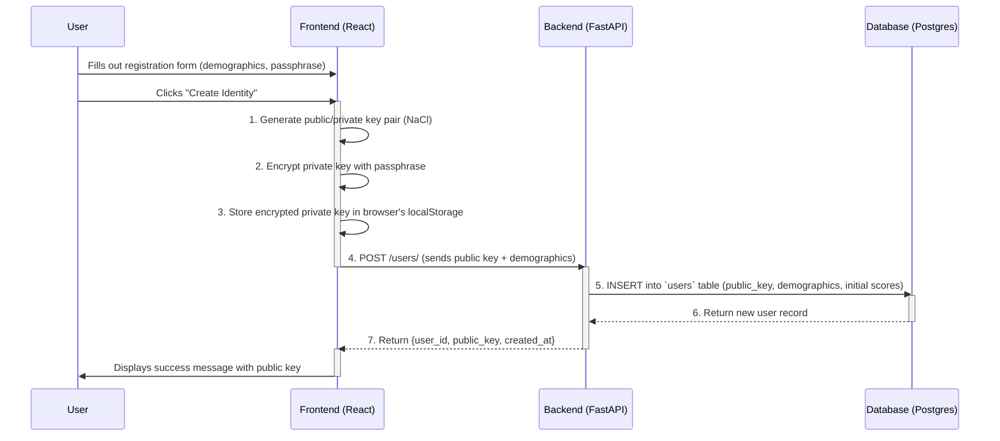
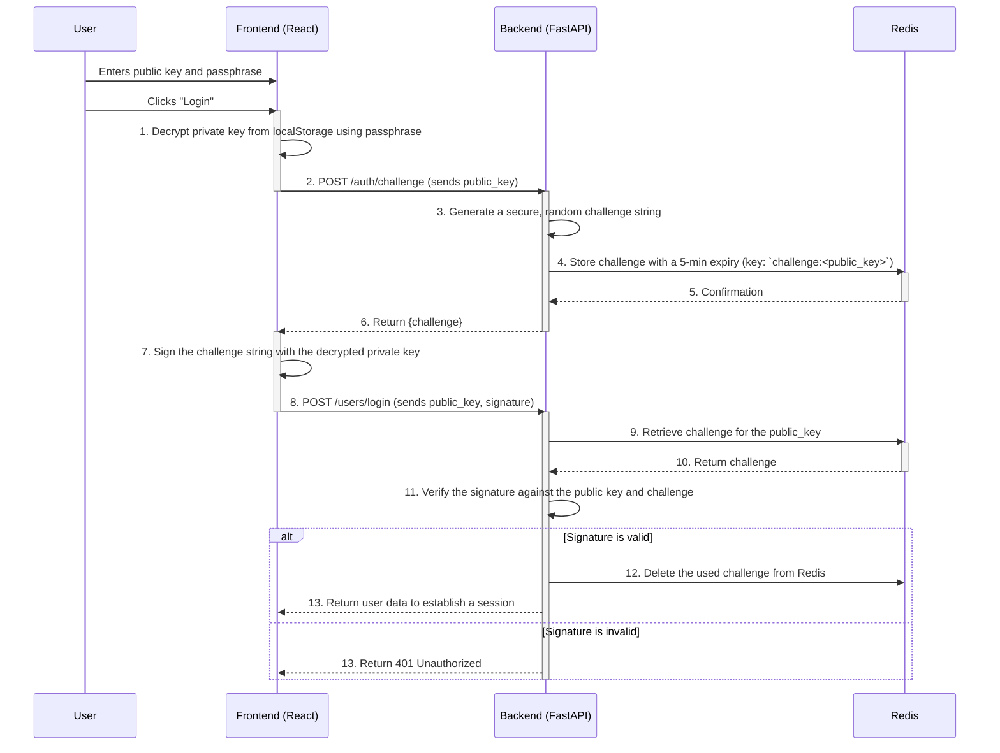
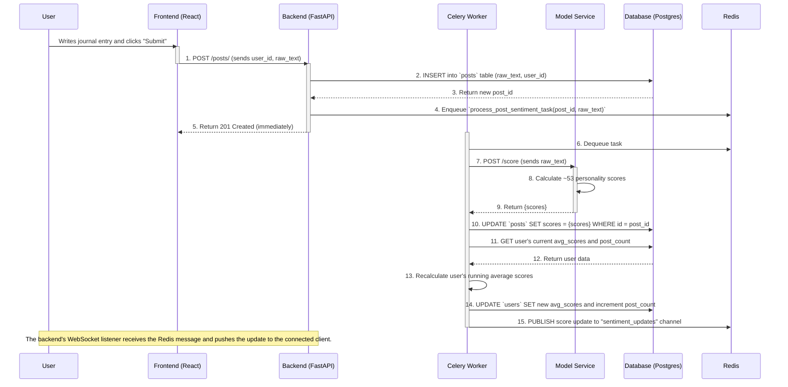

# 2. Data Flow

This document details the sequence of operations and data movement for the core user-facing features of the Silhouet application.

## 2.1 User Registration Flow

This flow describes how a new, anonymous identity is created. The primary design goal is to establish a user account without the server ever handling a password or private key.

**Key Takeaways:**
*   The user's private key **never leaves the browser**.
*   The server only ever sees the public key, which acts as the user's identifier.
*   The user's ability to log in is tied to their passphrase and the specific browser/device where the encrypted key is stored.

## 2.2 User Login/Authentication Flow

This flow uses a challenge-response mechanism to verify the user's identity. This proves the user possesses the private key corresponding to their public key without ever transmitting the key itself.

## 2.3 Post Submission and Scoring Flow

This flow is asynchronous to ensure the user gets a fast response, while the computationally intensive scoring happens in the background.

### Implementation Notes & Future Improvements

*   **Post Authentication**: Currently, the `POST /posts/` endpoint identifies the user via the `user_id` in the request body. **Future Improvement**: This endpoint should be protected to ensure only the currently logged-in user can post on their own behalf. This involves checking for an active, authenticated session on the backend before accepting the post.
*   **Real-time Frontend Updates**: The frontend currently polls for score updates using a `setTimeout` after submitting a post. **Future Improvement**: The frontend will be updated to use a WebSocket listener to receive score updates pushed from the backend in real-time, providing a more responsive user experience. This work is planned for a later stage.
